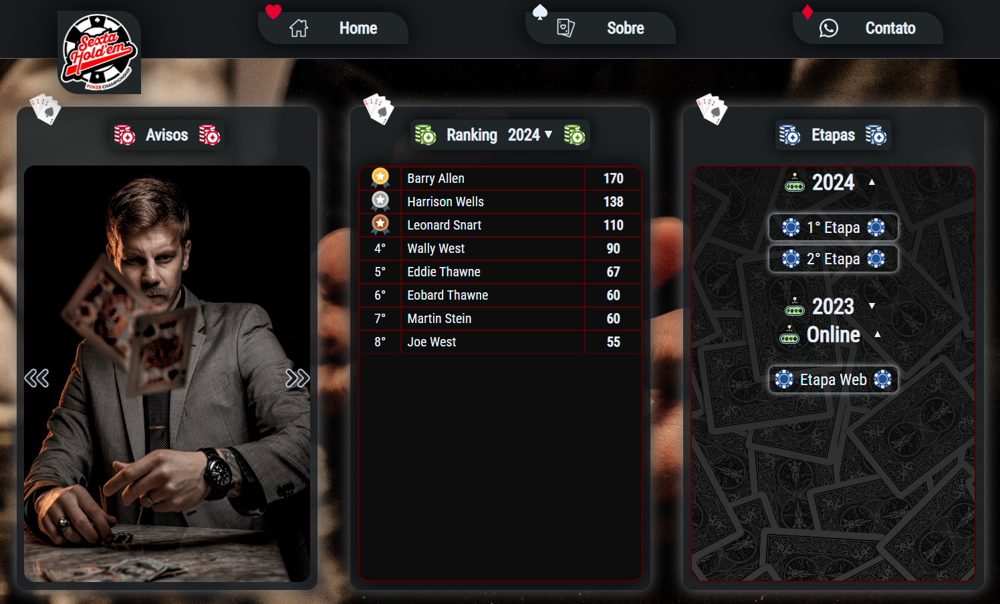

# Sexta Hold'em, a House Poker Platform 🃏

> This is the Sexta Hold'em platform, an application for management, advertising and customer activities of a poker house.

  
  
  
  
  
  
  
  
  
  

## :book: About
This application has 3 main functionalities, which are:

- Administrator management, the system administrator can do the CRUD of stages, with score ranking, players, being able to activate and deactivate them and others.
- Advertising and promotion of the tournaments, informing about the news, there are also promotional photos of each stage and a screen about.
- Player activities and progress, each player can view their current progress, their score at each stage and their position in the general ranking for each year.

This repository is the API of the project, if you want to check the front-end, you can access [here](https://github.com/nakagawa25/poker-platform-page).

## 🖥️ Development
This was my first contact with React.JS, Docker, Cloud Computing and DevOps in a personal project. I used ChatGPT a lot to help me learn and solve more specific problems.

I took the opportunity to apply some concepts such as:
 - Generics <T> to all Back-end projects, making the code more scalable and easier to maintain.
 - Clean Architecture, for the same reason and to improve the project organization.
 - Generics Components and Dictionaries in React.JS, to learn more about React.
 - Information security concepts in the API, front-end and application infrastructure.

## ⚒️ Technologies
- [C#](https://docs.microsoft.com/pt-br/dotnet/csharp/)
- [.NET 7](https://learn.microsoft.com/pt-br/dotnet/core/whats-new/dotnet-7)
- [Entity Framework](https://learn.microsoft.com/pt-br/ef/)
- [PostgreSQL](https://www.postgresql.org/)
- [React](https://react.dev/)
- [Docker](https://www.docker.com/)
- [Hostinger](https://www.hostinger.com.br/)
- [Azure](https://azure.microsoft.com/pt-br/)
- [ChatGPT](https://chat.openai.com/)

## 📜 License
This application is a client project who allowed me to publish the source code here, it is running in production now, you can check [here](https://sextaholdem.com.br).
